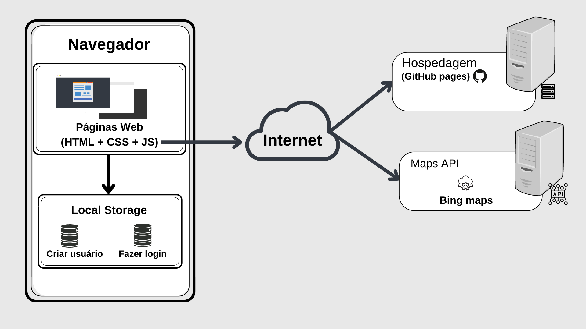

# Arquitetura da Solução

Pré-requisitos: <a href="3-Projeto de Interface.md"> Projeto de Interface</a>

Definição de como o software é estruturado em termos dos componentes que fazem parte da solução e do ambiente de hospedagem da aplicação.

## Diagrama de componentes

Diagrama que permite a modelagem física de um sistema, através da visão dos seus componentes e relacionamentos entre os mesmos.

Exemplo: 

Os componentes que fazem parte da solução são apresentados na Figura 20.

Figura 20 - Arquitetura da Solução

A solução implementada conta com os seguintes módulos:
- **Navegador** - Interface básica do sistema  
  - **Páginas Web** - Conjunto de arquivos HTML, CSS, JavaScript e imagens que implementam as funcionalidades do sistema.
   - **Local Storage** - armazenamento mantido no Navegador, onde são implementados bancos de dados baseados em JSON. São eles: 
     - **Criação** - Criar usuário no sistema
     - **Login** - Fazer login no sistema
 - **Maps API** - plataforma que permite utilizar bing maps
 - **Hospedagem** - local na Internet onde as páginas são mantidas e acessadas pelo navegador. 

> **Links Úteis**:
>
> - [Whimsical](https://whimsical.com/)

Inclua um diagrama da solução e descreva os módulos e as tecnologias que fazem parte da solução. Discorra sobre o diagrama.

<a href="https://www.figma.com/file/bVtZWbFrOazzYkKon3pfYU/User-Flow?node-id=0%3A1">Acesse ao User flow completo.</a>
Legenda: 1° opção:

<ul>
  <li>Página inicial: 01</li>
  <li>Página Resultado de pesquisas: 02</li>
  <li>Página de divulgação do profissional ou empresa: 03</li>
  <li>Página de divulgação  de produto ou serviço: 04</li> 
</ul>

A imagem a seguir ilustra a 1° opção de acesso ao fluxo do usuário em nossa solução.
Ao clicar na barra de pesquisa da página 01 o usuário será direcionado para a página 02 onde é exibido os resultados da sua pesquisa. 
Logo após ele pode tanto clicar no botão visitar quanto clicar no ícone na imagem do serviço/empresa pesquisado no mapa que será direcionado para a página 03.
Podendo também utilizar o carrossel na página 01 ao clicar no prestrador de serviço desejado será direcionado para a página 04 onde está as informações do prestrador de serviço, tendo a possibilidade de clicar no carrossel e sendo direcionado para a página 04. Abaido de cada página tem um rodapé contendo categorias abrangentes para que o usuário possa navegar de acordo com seu gosto e necessidade.

 
  

Legenda 2° opção:

<ul>
  <li>Pág inicial: 01</li>
  <li>Pág Login de Usuário: 02</li>
  <li>Pág Cadastro de Usuário: 03</li>
  <li>Pág Alterar Senha: 04</li>
  <li>Pág Recuperar Senha: 05</li>
  <li>Pág formulário inicial para edição de páginas: 06</li>
  <li>Pág de Perfil do usuário: 07</li>
  <li>Pág Editar Perfil Usuário: 08</li>
  <li>Pág Publicar Página: 09</li>
  <li>Pág Criar páginas: 10</li>
  <li>Pág de divulgação do profissional ou empresa: 11</li>
  <li>Pág de perfil do Usuário-empresa:12</li>
  <li>Pág editar usuário divulgador: 13</li>
  <li>Pág de edição de página de Produto ou Serviço: 14</li>
  <li>Pág de divulgação de produto ou serviço: 15</li>
</ul>

A imagem a seguir ilustra a 2° opção de acesso ao fluxo do usuário em nossa solução.

<h3> Possibilidade 01</h3>

Na página 01 temos o menu com 3 possibilidades de direção para o usuário, na primeira é o botão "Para empresas", o usuário é direcionado para página 03, aqui o MEI ou ME se cadastra de acordo com suas preferências de empresa. Após o preenchimento dos dados na página 03 ele é direcionado para página 06 onde completa o cadastro com os dados de sua empresa. Após criar a conta é direcionado para a página 09 onde é possível publicar sua página contendo informações que interessa seu cliente. Nessa mesma página o usuário/MEI/ME tem possibilidade de adicionar páginas detalhadas sobre seu produto/serviço prestrado. Ao concluir essa etapa ele é redirecionado para página 10 onde vai preencher detalhadamente seus serviços/produtos. Na página 11 o usuário pode editar suas páginas, seu perfil e informações pessoais da sua empresa.

<h3> Possibilidade 02</h3>

O usuário é alguém que almeja buscar serviços/produtos, ao acessar a página 01 ele clica em cadastrar-se e é direcionado para página 03 criando sua conta de usuário comum, ao concluir seu cadastro o usuário é enviado para página 07 que contem sua foto, descrição sobre ele, último vez online, um lista com seus serviços/produtos favoritos, mesmo sendo um usuário comum ele pode divulgar serviços/produtos de terceiros ou de fabricação própria através do botão fazer divulgação. Após clicar no botão ele é redirecionado para a página 06 onde colocar as informações de empresa, logo após o preenchimento ele é redirecionado para página 09 onde faz a publicação da página simplicada, tendo opção de detalhar através da página 10 onde o usuário descreve um todo da empresa para ser encontrada por seus clientes. Assim como na primeira possibilidade o usuário comum pode editar suas páginas e informações desejadas.

<h3> Possibilidade 03</h3>

O usuário já fez o cadastro e acessa a página 01 e clica em entrar que é direcionado para página 02 onde faz o acesso ao sistema, caso venha esquecer a senha ele pode acionar "Esqueceu a senha" que será redirecionado para página 05 onde coloca seu e-mail e logo após o envio do e-mail e ele clicar no link no e-mail é redirecionado para página 04 onde faz uma nova senha de acesso, após concluir ele retorna para página 02 onde faz o acesso ao sistema. Tendo assim acesso a página 07 onde está suas informações pessoais seu favoritos e demais aspectos.

 
  

## Tecnologias Utilizadas

Descreva aqui qual(is) tecnologias você vai usar para resolver o seu problema, ou seja, implementar a sua solução. Liste todas as tecnologias envolvidas, linguagens a serem utilizadas, serviços web, frameworks, bibliotecas, IDEs de desenvolvimento, e ferramentas.

Apresente também uma figura explicando como as tecnologias estão relacionadas ou como uma interação do usuário com o sistema vai ser conduzida, por onde ela passa até retornar uma resposta ao usuário.

## Hospedagem

Explique como a hospedagem e o lançamento da plataforma foi feita.

> **Links Úteis**:
>
> - [Website com GitHub Pages](https://pages.github.com/)
> - [Programação colaborativa com Repl.it](https://repl.it/)
> - [Getting Started with Heroku](https://devcenter.heroku.com/start)
> - [Publicando Seu Site No Heroku](http://pythonclub.com.br/publicando-seu-hello-world-no-heroku.html)
